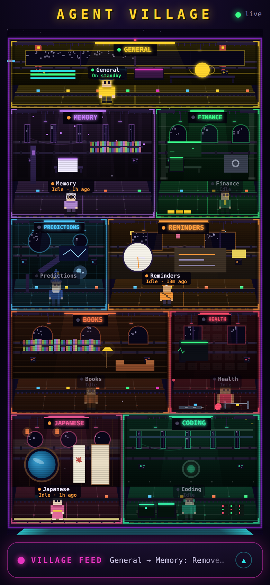

# Agent Village Dashboard

A real-time, read-only **window** into your Hermes agents. The village is a
packed pixel-art floor plan of varied rooms connected by a central walkable
corridor. When General delegates, he pauses to decide, walks down the corridor
to the target agent, the agent works, and replies — all driven by the real
traces in `~/.hermes/state.db`.

The dashboard never thinks or acts on its own — **General does all the
delegating using his own intelligence**. The dashboard only observes and
animates. See [`docs/HERMES_PROMPT.md`](docs/HERMES_PROMPT.md) for the markers to
teach General.



## How it works

| Concern | Signal used |
|---|---|
| **Status** (working/idle/offline/done) | most-recent message per `thread_id`, running cron jobs, and `[[done: …]]` markers |
| **Delegation** (the walk) | a child session spawned under General's thread **or** a `[[delegate: agent \| task]]` marker in his reply |
| **Completion** (instant idle + TLDR) | `[[done: agent \| result]]` marker — no waiting on an idle window |
| **Collaboration** (the Office) | `[[collab: a, b \| task]]` marker — named agents walk to the shared Office |
| **Sub-agents** (the Bay) | child sessions Hermes spawns (`sessions.parent_session_id`) — no marker needed |
| **Current task** (chip on the map) | the live delegation/cron the agent is on |

Delegation, completion and collaboration are General's own explicit decisions
(markers) — the keyword heuristic only bootstraps before markers are adopted.
**No Todoist writes** — side effects belong to Hermes, not the viewer.

## Files

| File | Role |
|---|---|
| `agents.json` | Single source of truth: agent ids, threads, emojis, grid positions, colors |
| `agent_status.py` | Reads `state.db` / `jobs.json`; computes status + delegations |
| `server.py` | FastAPI: serves the UI and the `/api/*` endpoints + SSE stream |
| `index.html` | DOM + CSS frontend. Walk = CSS `transform` transition (immune to status refresh) |

## Run

```bash
pip install -r requirements.txt
python server.py            # http://0.0.0.0:8765
```

Then open the dashboard (e.g. behind your Tailscale funnel at
`https://…/agents/`).

### Configuration (env vars)

| Var | Default | Purpose |
|---|---|---|
| `HERMES_DIR` | `~/.hermes` | Base Hermes directory |
| `HERMES_STATE_DB` | `$HERMES_DIR/state.db` | SQLite state DB |

Check what the server detected:

```bash
curl localhost:8765/api/diagnostics
```

## Endpoints

- `GET /` — dashboard
- `GET /agents.json` — shared agent registry
- `GET /api/agents` — agents with live status + diagnostics
- `GET /api/delegations?since=<epoch>` — recent delegation events
- `GET /api/cron` — cron jobs grouped by agent (human-readable schedules)
- `GET /api/collab` — the active collaboration session, if any
- `GET /api/subagents` — live spawned sub-agent sessions
- `GET /api/agents/stream` — SSE; pushes agents + collab + subagents when the DB
  changes (cheap `MAX(messages.id)` watermark), with a 15s heartbeat

## Schema assumptions

Confirmed against the live Hermes DB:

```
messages(id, session_id, role, content, timestamp, tool_calls, tool_name, active, …)
sessions(id, thread_id, parent_session_id, started_at, ended_at, end_reason, …)
```

A message's "topic" is the `thread_id` of its session (join
`messages.session_id → sessions.id`). Thread ids: General 1, Reminders 2,
Finance 5, Memory 6, Predictions 7, Books 81, Health 119, Japanese 362.
Coding shares thread 1 with General.

> If the walk never fires, it means General isn't spawning child sessions on
> delegation. The dashboard shows what General actually does — so the fix is on
> the Hermes side (have General spawn/hand-off a session in the target thread),
> not here.
